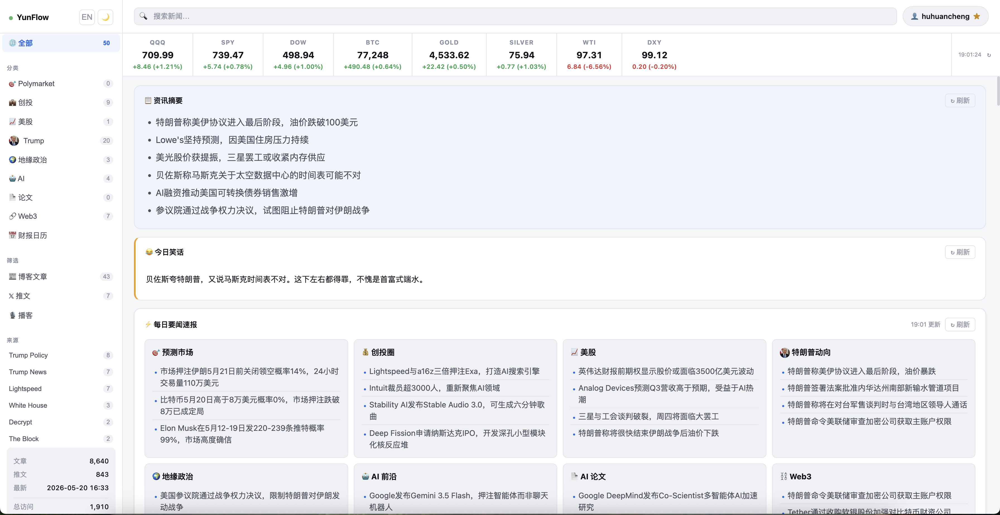
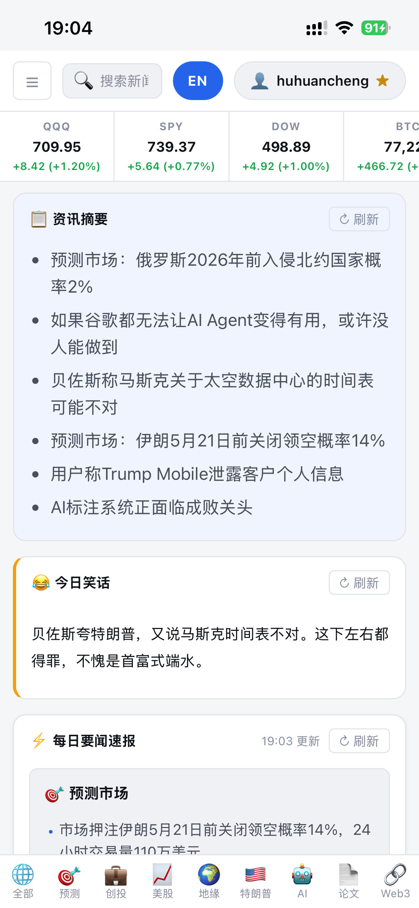
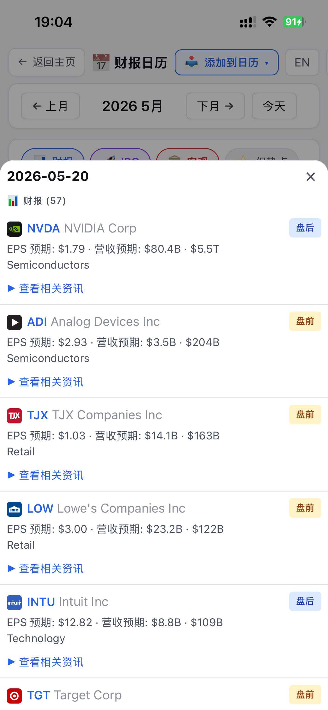

# YunFlow — Your AI & Markets News Monitor

<p align="center">
  <a href="https://yunflow.net">
    
  </a>
</p>

<p align="center">
  <a href="https://yunflow.net">
    
  </a>
</p>

> Self-hosted dashboard that streams AI, markets, geopolitics, and prediction-market news from X and RSS into one place.

YunFlow collects updates from leading AI researchers, labs, founders, technical blogs, finance feeds, and prediction markets across X (Twitter) and RSS, stores everything in SQLite, and serves the results through a bilingual web dashboard. It also generates AI-curated digests, daily briefings, and snarky financial jokes via DeepSeek, sends email digests on a 4-slot schedule, and exposes the dataset through an MCP server for coding agents.

## Product Preview

<p align="center">
  <strong>Desktop browser view</strong><br>
  <sub>Read the YunFlow news website with live markets, curated briefings, source filters, category navigation, and searchable mixed feeds.</sub>
</p>

<p align="center">
  <a href="https://yunflow.net">
    
  </a>
</p>

<br>

<table>
  <tr>
    <td width="33%" align="center" valign="top">
      
      <br>
      <sub><strong>Mobile news feed</strong><br>Scan-friendly updates in a phone browser.</sub>
    </td>
    <td width="33%" align="center" valign="top">
      <a href="https://yunflow.net">
        
      </a>
      <br>
      <sub><strong>Mobile browser tour</strong><br>Navigation, filtering, and reading flow in motion.</sub>
    </td>
    <td width="33%" align="center" valign="top">
      
      <br>
      <sub><strong>Finance briefing</strong><br>Deeper market context across earnings, IPOs, macro events, and catalysts.</sub>
    </td>
  </tr>
</table>

**Features:**
- 🌐 **Live website** — [yunflow.net](https://yunflow.net) — try it before installing
- **X & RSS Monitors** — 8 AI figures (Karpathy, Sam Altman, etc.) + 25+ feeds (OpenAI, Anthropic, DeepMind, arXiv, finance, geopolitics)
- **Web Dashboard** — Bilingual (zh/en), live market ticker, category filters, full-text search
  - 📋 **News Digest** — AI-curated pool of 30 highlights across 6 domains; refresh cycles next batch of 6 (regenerated every 30 min)
  - 😂 **Joke Panel** — DeepSeek-generated punchlines grounded in today's real news, score-ranked best-first
  - ⚡ **Daily Briefing** — In-depth finance briefing with 财报/earnings context, IPO calendar signals, macro events, US stocks, and market-moving catalysts
  - 📅 **Earnings Calendar** — Finnhub-powered earnings + IPO + macro events, with mini-cards linking to related news
  - 🔍 **Smart Search** — Auto-hides context panels, ESC to exit, restores your prior view on clear
- **Email Digest** — 4-slot Gmail schedule (06:00 早报 / 12:00 午报 / 18:00 晚报 / 22:00 夜报) with importance-ranked summary, top jokes, calendar preview, and per-category briefing
- **AI Translation** — DeepSeek API auto-translates English titles/summaries to Chinese *(optional)*
- **MCP Server** — Claude Code can query the database directly via MCP tools

---

## Quick Start

### Choose Your Deployment Method

**🐳 Docker (Recommended for Production)**
- Production-ready with HTTPS/SSL
- Nginx reverse proxy
- Automated backups
- One-command deployment

👉 **[Docker Deployment Guide →](README-DOCKER.md)** | **[Quick Reference](DOCKER-QUICKREF.md)**

```bash
# Local development
./scripts/setup.sh

# Production with SSL
USE_LETSENCRYPT=true DOMAIN=your-domain.com SSL_EMAIL=you@email.com ./scripts/setup.sh
```

**🐍 Python (Simple Setup)**
- Direct Python execution
- Good for development/testing
- No containerization needed

### Python Installation

**1. Clone & install dependencies**

```bash
git clone https://github.com/ziyunli-2023/YunFlow.git
cd YunFlow
pip install -r requirements.txt uvicorn
```

### 2. Configure environment variables

Copy the example file and fill in your credentials:

```bash
cp .env.example .env
```

Edit `.env`:

```env
# Required for tweet monitoring (leave empty to skip)
X_BEARER_TOKEN=your_bearer_token_here

# Required for email notifications (leave empty to disable)
EMAIL_SENDER=your_gmail@gmail.com
EMAIL_APP_PASSWORD=xxxx_xxxx_xxxx_xxxx
EMAIL_RECIPIENT=where_to_receive@example.com

# Required for Chinese translation (leave empty to disable)
DEEPSEEK_API_KEY=sk-your_deepseek_key_here

# Required for the earnings calendar sub-page (/earnings)
# Free tier at https://finnhub.io/dashboard — leave empty to show macro events only
FINNHUB_API_KEY=your_finnhub_key_here

# Web dashboard port
WEB_PORT=8000
```

**All fields are optional** — the monitor runs fine with all fields empty (no tweets, no email, no translation).

#### Getting API keys

| Service | How to get |
|---|---|
| X Bearer Token | [developer.twitter.com](https://developer.twitter.com/en/portal/dashboard) → Create app → Bearer Token |
| Gmail App Password | Google Account → Security → 2-Step Verification → App Passwords |
| DeepSeek API Key | [platform.deepseek.com/api_keys](https://platform.deepseek.com/api_keys) |
| Finnhub API Key | [finnhub.io/dashboard](https://finnhub.io/dashboard) — free tier covers earnings + IPO calendars |

### 3. Run

```bash
python main.py
```

Open web dashboard: `http://localhost:8080`

---

## MCP Server (for Claude Code)

Run as an MCP server so Claude Code can query your news database directly:

```bash
python mcp_server.py
```

Add to your Claude Code MCP config (`~/.claude/settings.json` or `.mcp.json`):

```json
{
  "mcpServers": {
    "ai-news-monitor": {
      "command": "python",
      "args": ["/path/to/AI-News/mcp_server.py"]
    }
  }
}
```

### Available MCP Tools

| Tool | Description |
|---|---|
| `get_latest_tweets` | Latest tweets, filterable by user |
| `get_latest_blog_posts` | Latest blog posts, filterable by source |
| `get_all_news` | Mixed feed of tweets + posts |
| `get_new_since_last_check` | New content since last query |
| `get_stats` | Database statistics |
| `list_tracked_sources` | All tracked sources |
| `search_news` | Full-text search |
| `get_top_posts` | Top content by engagement |
| `get_health` | Monitor health status |
| `get_by_category` | Filter by category (researcher/founder/safety/etc.) |

---

## Running the Service

### systemd service (Linux / WSL server)

The recommended way to run the service. Logs go to `logs/app.log`.

```bash
# Start
sudo systemctl start ai-news

# Stop
sudo systemctl stop ai-news

# Restart (e.g. after pulling new code)
sudo systemctl restart ai-news

# View status
sudo systemctl status ai-news

# Tail live logs
tail -f logs/app.log
```

Enable auto-start on boot:

```bash
sudo systemctl enable ai-news
```

### Manual start

```bash
# Foreground (useful for debugging)
python main.py

# Background, logging to main.log
python main.py >> logs/main.log 2>&1 &
```

### Check if the service is running

```bash
ps aux | grep main.py | grep -v grep
```

If the output is empty, the process is not running. Restart it with `sudo systemctl restart ai-news` or manually (see above).

---

## Project Structure

```
YunFlow/
├── main.py              # Entry point: web dashboard + monitors + email
├── mcp_server.py        # MCP server entry (for Claude Code)
├── config.py            # Tracked accounts, RSS sources, polling intervals
├── storage.py           # SQLite database operations
├── rss_monitor.py       # RSS polling monitor
├── nitter_monitor.py    # X (Twitter) monitor
├── x_monitor.py         # X API wrapper
├── ai_processor.py      # DeepSeek translation + digest / joke / briefing
├── notifier.py          # Email digest scheduler (06/12/18/22)
├── web_server.py        # FastAPI dashboard, search, panels, market ticker
├── earnings_monitor.py  # Finnhub earnings + IPO + macro calendar
├── polymarket_monitor.py# Prediction market feed
├── papers_monitor.py    # HuggingFace papers + arXiv trending
├── subscribers.py       # Email subscriber list management
├── .env.example         # Environment variable template
├── requirements.txt     # Python dependencies
└── logs/                # Runtime logs (auto-created, not tracked in git)
```

## Customizing Tracked Sources

Edit `config.py` to add/remove:
- X accounts to follow
- RSS feeds to monitor
- Polling intervals per source tier

---

## License

MIT
